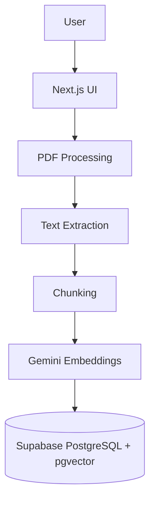
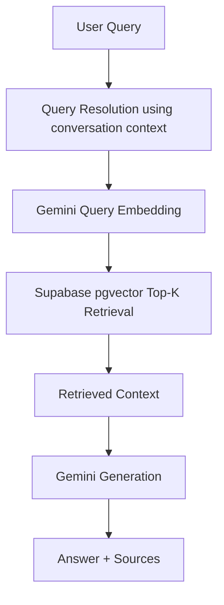
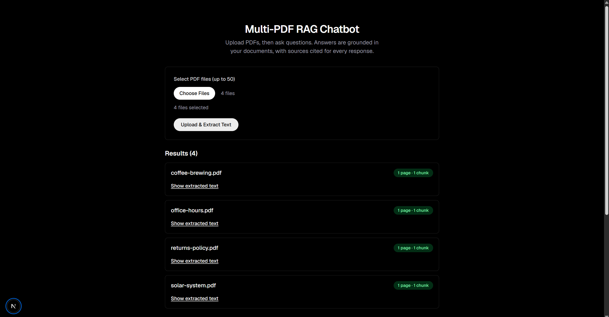
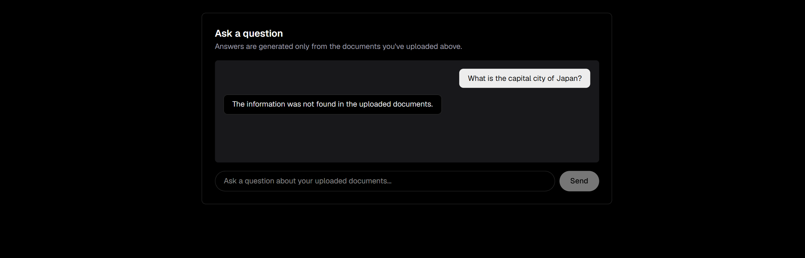

# Multi-PDF RAG Chatbot

## 1. Overview

Multi-PDF RAG Chatbot is a Next.js application that lets a user upload multiple PDF documents and ask natural-language questions about them. Questions are answered using Retrieval-Augmented Generation (RAG): the app finds the most relevant passages across all uploaded PDFs using vector search, and asks Google Gemini to answer strictly from those passages. Every answer is returned alongside the filename and page number it was drawn from, and the app explicitly says so when a question can't be answered from the uploaded documents rather than guessing.

This was built incrementally as a series of scoped milestones (upload → extraction → deduplication → chunking → embeddings → retrieval → generation → chat UI → conversational follow-ups → correctness cleanup), each implemented and verified against a real Supabase + Gemini backend before moving to the next.

## 2. Features

- **Multiple PDF upload** — select and upload up to 50 PDF files in one request
- **PDF validation** — rejects non-PDF files by extension and by checking the `%PDF-` file signature, not just the browser-supplied MIME type
- **Page-aware text extraction** — extracts text per page (via `pdf-parse`) and preserves the original page number for every piece of text
- **Duplicate document detection using SHA-256** — re-uploading the exact same file is detected by content hash and skips re-processing entirely
- **Configurable chunking with overlap** — page text is split into overlapping, word-aligned chunks for retrieval
- **Gemini embeddings** — every chunk gets a 768-dimensional embedding from Google's `gemini-embedding-001` model
- **Supabase PostgreSQL + pgvector** — chunks and their embeddings are stored in Postgres using the `pgvector` extension
- **Top-K semantic retrieval** — cosine-similarity vector search over stored chunks, run inside Postgres via a `match_chunks` RPC function
- **Grounded Gemini answer generation** — answers are generated only from retrieved chunk content, with an explicit instruction not to use outside knowledge
- **Multi-document questions** — a single question can be answered using chunks retrieved from more than one uploaded document
- **Document comparison/synthesis** — verified with questions that require combining information from two different documents in one answer
- **Conversational follow-up questions** — recent conversation history helps interpret follow-ups (e.g. "Does *it* cover opened items too?") without using that history as a source of facts
- **Filename + page citations** — every answer's sources are returned as structured metadata (filename, page number, chunk id, similarity score), taken directly from retrieval, never generated by the LLM
- **Graceful handling of unsupported questions** — when retrieved context doesn't support an answer, the app returns a fixed "not found" message and an empty sources list, instead of guessing or showing irrelevant sources
- **Basic processing/error handling** — invalid files, corrupted PDFs, database failures, and Gemini API failures are all caught and surfaced as clear errors rather than silently failing or pretending success

## 3. Architecture

**Document ingestion pipeline** (upload time):



**Question-answering pipeline** (chat time):



## 4. RAG Pipeline

**Document pipeline** — runs once per uploaded file, in `POST /api/upload`:

1. Each file is validated as a real PDF (extension + `%PDF-` signature check, size limit).
2. The file's bytes are SHA-256 hashed and checked against the `documents` table. If the hash already exists, processing stops here — the file is reported as a duplicate, no new rows are created.
3. For a new hash, a `documents` row is inserted, then the PDF is parsed page-by-page.
4. Each page's text is split into overlapping chunks.
5. Every chunk's text is sent to Gemini (`gemini-embedding-001`) to get a 768-dimensional embedding.
6. Each chunk, with its page number, content, and embedding, is inserted into the `chunks` table.

**Query pipeline** — runs once per chat message, in `POST /api/chat`:

1. The current question, plus recent conversation history (if any), is optionally rewritten into a focused standalone question via a small Gemini call — this exists only to resolve references like "it"/"they"/"this" using prior turns; with no history this step is skipped entirely.
2. That (possibly resolved) question is embedded with Gemini.
3. The embedding is passed to the `match_chunks` Postgres function, which does the cosine-similarity Top-K search inside Supabase/pgvector and joins in each chunk's document filename.
4. The retrieved chunks' text (only the text — no filenames/page numbers) is assembled into a context block.
5. The context, the original question, and recent conversation history are sent to Gemini for generation, with a system instruction to answer only from the context and to say so explicitly if it can't.
6. The response returned to the client pairs the generated answer with source metadata built directly from the retrieval results — if the model's answer is the fixed "not found" message, sources are returned as an empty array instead of the (irrelevant) retrieved candidates.

## 5. Technology Stack

- [Next.js](https://nextjs.org/) (App Router)
- [TypeScript](https://www.typescriptlang.org/)
- [Tailwind CSS](https://tailwindcss.com/)
- [Supabase](https://supabase.com/) PostgreSQL
- [pgvector](https://github.com/pgvector/pgvector)
- [Google Gemini API](https://ai.google.dev/) (`@google/genai`)
- [pdf-parse](https://www.npmjs.com/package/pdf-parse)

## 6. Database Structure

Two tables in Supabase Postgres, plus a retrieval RPC function.

**`documents`**

| Column | Type | Notes |
|---|---|---|
| `id` | `bigint` | Primary key |
| `filename` | `text` | Original uploaded filename |
| `file_hash` | `text` | SHA-256 hash of the file's bytes, unique — the basis for duplicate detection |
| `created_at` | `timestamptz` | |

**`chunks`**

| Column | Type | Notes |
|---|---|---|
| `id` | `bigint` | Primary key |
| `document_id` | `bigint` | References `documents(id)` |
| `page_number` | `integer` | Source page for this chunk's text |
| `content` | `text` | The chunk's text |
| `embedding` | `vector(768)` | **768-dimensional** embedding from `gemini-embedding-001`; `NULL` until embedded |
| `created_at` | `timestamptz` | |

A `match_chunks(query_embedding, match_count)` Postgres function performs the cosine-similarity search over `chunks` and joins in the filename from `documents`. A reference copy of this function (reconstructed for reproducibility, since it was created directly in Supabase — see `supabase/migrations/` for the exact provenance notes) lives at [supabase/migrations/20260911000000_match_chunks_function.sql](supabase/migrations/20260911000000_match_chunks_function.sql).

## 7. Duplicate Detection

Every uploaded file's raw bytes are hashed with SHA-256 before any processing happens. That hash is checked against `documents.file_hash` (a unique column):

- **Hash already exists** → the file is reported back as a duplicate. No new `documents` row, no text extraction, no chunking, and no embedding calls happen — the existing document is left untouched.
- **Hash is new** → a `documents` row is inserted for that hash, and the file proceeds through extraction, chunking, and embedding as normal.

This makes re-uploading the same PDF (accidentally or intentionally) cheap and side-effect-free instead of duplicating rows or spending extra Gemini API calls.

## 8. Retrieval

Retrieval is implemented as a single call to a Supabase RPC function, `match_chunks`, which runs entirely inside Postgres using `pgvector`'s cosine-distance operator (`<=>`). Given a query embedding and a `match_count` (Top-K), it returns the K most similar chunks — each with its similarity score — joined with their source document's filename, filtering out any chunk whose embedding is still `NULL`.

- **Similarity metric:** cosine similarity
- **Top-K:** configurable per call; **default is 5**
- The application's retrieval module (`lib/retrieval/search.ts`) only embeds the query and calls this RPC — it does not itself compute similarity in JavaScript.

## 9. Grounding and Citations

The app is designed so the model cannot free-associate an answer or invent a source:

- Only the **text content** of retrieved chunks is given to Gemini as context — no filenames, page numbers, or ids are included in what the model sees, so it has nothing citation-shaped to copy or invent.
- Gemini's system instruction explicitly restricts it to answering from the supplied context, forbids outside/general knowledge, and forbids mentioning any citation, filename, or page number itself.
- If the context doesn't contain enough information, the model is instructed to respond with an exact, fixed sentence: *"The information was not found in the uploaded documents."* When that happens, the API also clears the response's `sources` array to `[]`, since the retrieved chunks weren't actually relied on for the answer.
- **Source metadata (filename, page number, chunk id, similarity) always comes directly from the retrieval results returned by `match_chunks`** — never parsed or generated from the LLM's output — so a citation shown to the user is guaranteed to correspond to a chunk that was actually retrieved.

## 10. Conversation Context

The chat UI keeps a simple in-memory list of the conversation for the current browser tab and sends the most recent messages (capped at 6) along with each new question to `/api/chat`. That history is used in two narrow ways:

1. **Retrieval focus** — if history is present, a small Gemini call rewrites the current question into a standalone version, resolving references like "it"/"they"/"this" using prior turns, so the vector search stays focused on the user's actual current intent instead of being diluted by unrelated earlier topics. With no history, this step is skipped and retrieval behaves exactly as it would for a single, standalone question.
2. **Answer phrasing** — the same recent history is also given to Gemini during generation, clearly labeled as "for understanding the question only," so the final answer's wording can reflect what was just discussed.

In both cases, conversation history is explicitly instructed to never be treated as a fact the answer can rely on — only the retrieved document chunks are evidence.

## 11. Setup

**Prerequisites:**

- Node.js (v20+ recommended)
- A Supabase project with:
  - the `pgvector` extension enabled
  - the `documents` and `chunks` tables created (see [Database Structure](#6-database-structure))
  - the `match_chunks` function created (see [supabase/migrations/](supabase/migrations/))
- A Google Gemini API key

**Environment variables** — create a `.env.local` file in the project root (never commit this file):

```
NEXT_PUBLIC_SUPABASE_URL=
NEXT_PUBLIC_SUPABASE_PUBLISHABLE_KEY=
SUPABASE_SECRET_KEY=
GEMINI_API_KEY=
```

| Variable | Used by | Notes |
|---|---|---|
| `NEXT_PUBLIC_SUPABASE_URL` | client + server | Your Supabase project URL |
| `NEXT_PUBLIC_SUPABASE_PUBLISHABLE_KEY` | client + server | Supabase publishable (public) key |
| `SUPABASE_SECRET_KEY` | server only | Supabase secret key — used only by server-side code (`lib/supabase/server.ts`); never exposed to the browser |
| `GEMINI_API_KEY` | server only | Google Gemini API key — used only by server-side code; never exposed to the browser |

Do not commit real values for any of these — `.env.local` is already in `.gitignore`.

## 12. Running the Project

```bash
# Install dependencies
npm install

# Run the development server
npm run dev

# Type-check
npx tsc --noEmit

# Lint
npm run lint

# Production build
npm run build

# Run the production build
npm run start
```

The app runs at `http://localhost:3000` by default (or whatever port you configure).

## 13. Testing and Evaluation

There is no automated test suite (unit/integration tests) in this repository. Instead, every milestone during development was manually and script-verified against the **real** Supabase project and Gemini API (not mocks) before moving on. The following were each explicitly exercised and confirmed working during development:

- **PDF upload** — multiple valid PDFs uploaded in one request, correct per-file page counts and extracted text returned
- **Invalid PDF handling** — wrong file extension, a file with a spoofed `.pdf` name but no valid `%PDF-` header, and an empty file were all rejected with clear per-file errors without failing the rest of the batch
- **Duplicate detection** — re-uploading the identical file was detected as a duplicate; confirmed via direct database queries that no second `documents` row or extra `chunks` rows were created
- **Chunking** — verified chunk counts, correct page-number attribution per chunk, and that consecutive chunks from the same page actually overlap in content
- **Embeddings** — confirmed via direct Supabase queries that stored embeddings are non-null and exactly 768-dimensional
- **Semantic retrieval** — verified Top-K returns the correct count for K = 1, 2, 4, 5; verified topically relevant documents rank highest for matching queries, with a visibly lower similarity ceiling for an unrelated query; verified the `match_chunks` RPC's cosine-similarity scores match an independent application-level calculation
- **Answer generation** — verified grounded, accurate answers for questions clearly answerable from a single uploaded document
- **Multi-document questions** — verified a single question combining two unrelated documents' topics was answered correctly for both parts, with sources from both documents
- **Unsupported questions** — verified questions with no relevant uploaded content return the exact fixed "not found" message with an empty `sources` array
- **Follow-up questions** — verified pronoun-based follow-ups (e.g. "What kind of planet is *it*?", "Does *it* cover opened items too?") were correctly resolved using conversation history and answered correctly from the documents
- **Source integrity** — verified that sources returned from `/api/chat` for a given query exactly match what `/api/search` independently returns for the same query, confirming sources are never altered or invented by the LLM
- **Responsive UI** — verified the chat interface renders and functions correctly at both desktop and mobile (375px) viewport widths with no horizontal overflow

## 14. Screenshots

### Main Interface



The PDF upload panel and the list of processed documents after uploading four PDFs — filename, page count, and chunk count for each.

### RAG Answer with Source


The question "Which planet is the largest in the solar system?" answered as "Jupiter is the largest planet in the solar system.", with its source shown as `solar-system.pdf, page 1`.

### Grounded Response



An unsupported question, "What is the capital city of Japan?", correctly answered with "The information was not found in the uploaded documents." instead of a guess.

## 15. Limitations

This project was built as a recruitment/demo-scale task, and the implementation reflects that honestly:

- **No authentication** — anyone with access to the deployed URL (or local dev server) can upload documents and use the chatbot; there is no per-user access control or data isolation
- **Conversation history is browser-side only** — chat history lives only in the current browser tab's memory; it is not persisted to Supabase or anywhere else, and is lost on page refresh
- **Demo/recruitment scale, not production scale** — retrieval fetches candidate chunks via a single RPC call with no pagination, caching, or load testing behind it; there's no rate limiting, usage quotas, or monitoring
- **No public deployment** — this has only been run and verified locally against a real Supabase + Gemini backend; it has not been deployed anywhere
- **No automated test suite** — correctness was verified through manual and scripted testing against the live backend during development (see [Testing and Evaluation](#13-testing-and-evaluation)), not through a CI-run test suite
- **Character-based chunking** — chunk boundaries are based on character counts, not token counts or semantic boundaries, which is simple but not optimal
- **Some early chunks lack embeddings** — a handful of chunks created during early development (before the embedding stage existed) still have `NULL` embeddings in the database; retrieval correctly excludes them, but they remain as unembedded rows rather than being backfilled
- **No reranking** — Top-K results from `match_chunks` are used as-is; there is no secondary reranking step
- **The `match_chunks` migration file is a reconstruction, not a literal database dump** — see [Database Structure](#6-database-structure) and the file's own header comment for details

## 16. Future Improvements

- Add authentication and per-user document isolation
- Persist conversation history (e.g. a `conversations` table) so chats survive a refresh
- Token-aware chunking and/or a reranking step over retrieved chunks
- Streaming responses in the chat UI
- A document management view (list/delete uploaded documents)
- An automated test suite and CI pipeline
- Backfill embeddings for any chunk still missing one
- Actual deployment, with the operational basics that implies (monitoring, rate limiting, backups)
